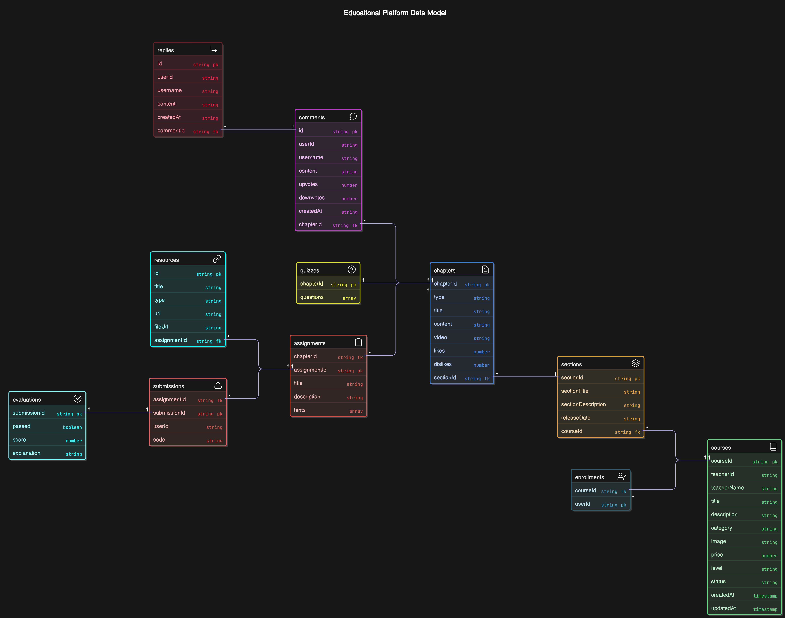
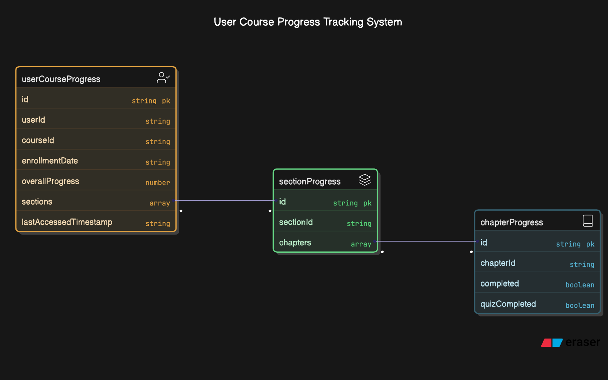
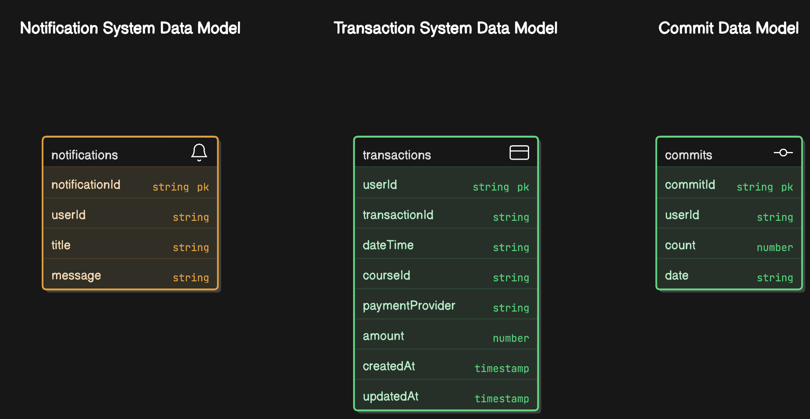

# GrowthHungry

GrowthHungry is a cutting-edge platform designed to empower individuals by enhancing their learning experiences, tracking progress, and fostering personal growth. This repository encapsulates the backend architecture and data flow for GrowthHungry, making it a one-stop solution for modern educational needs.

---

## Table of Contents

- [Introduction](#introduction)
- [Features](#features)
- [Schema Diagrams](#schema-diagrams)
- [Technologies Used](#technologies-used)
- [Installation](#installation)
- [Usage](#usage)
- [Contributing](#contributing)
- [License](#license)

---

## Introduction

GrowthHungry provides a seamless way to manage courses, track user progress, handle transactions, and deliver notifications. It enables users to:
- Enroll in courses.
- Monitor their learning journey with detailed progress tracking.
- Manage financial transactions related to course enrollments.
- Stay updated with notifications and personal commitment tracking.

---

## Features

1. **Course Management**
   - Create and manage course content with associated metadata.
   - Track enrollments and course completion statuses.

2. **User Progress Tracking**
   - Monitor section- and chapter-wise progress.
   - Mark quizzes and chapters as completed.

3. **Transaction Management**
   - Securely handle course payments.
   - Generate transaction histories for users.

4. **Notifications**
   - Send real-time updates to users about course events and reminders.

5. **Commit Tracking**
   - Maintain daily user activity streaks for motivation and accountability.

---

## Schema Diagrams

The following diagrams illustrate the key data models used in GrowthHungry:

### Course Schema


### User Progress Schema


### Transaction, Notification, Commit Schema


---

## Technologies Used

- **Backend**: Node.js, Express.js
- **Database**: DynamoDB
- **Authentication**: Clerk
- **API Documentation**: Swagger/OpenAPI
- **Other Tools**: AWS SDK, Dynamoose ORM

---

## Installation

Follow these steps to set up the project locally:

1. Clone the repository:
   ```bash
   git clone https://github.com/ArslanKamchybekov/ghai-lms
   ```

2. Navigate to the project directory:
   ```bash
   cd ghai-lms
   ```

3. Install dependencies:
   ```bash
   npm install
   ```

4. Configure environment variables by creating a `.env` file.

5. Start the server:
   ```bash
   npm run dev
   ```

---

## Usage

1. Access the server locally at `http://localhost:8001` and client at `http://localhost:3000`.
2. Use a tool like Postman or Swagger UI for testing endpoints.
3. Integrate the backend with your frontend or mobile application for a complete user experience.

---

## Contributing

We welcome contributions from the community! To contribute:

1. Fork the repository.
2. Create a new branch for your feature or bug fix:
   ```bash
   git checkout -b feature/your-feature-name
   ```
3. Commit your changes and push the branch:
   ```bash
   git commit -m "Add your message here"
   git push origin feature/your-feature-name
   ```
4. Open a pull request on GitHub.

---

## License

This project is licensed under the MIT License. See the `LICENSE` file for details.

---

Happy Learning! 🚀

